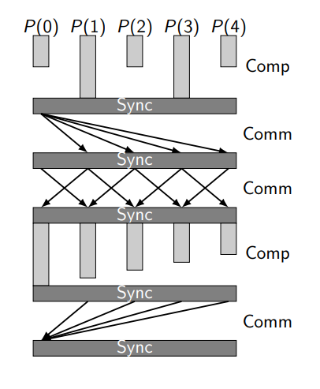
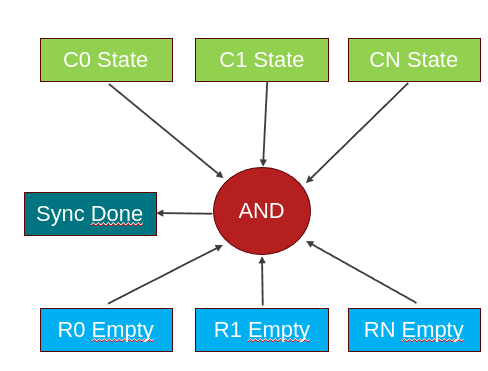

# CS629 Final Project: BSP machine on NoC

Team members:
* Julien de Castelnau
* Batuhan Keskin
* Madhur Kumar

This repo contains our final project for the [CS-629](https://edu.epfl.ch/coursebook/en/constructive-computer-architecture-CS-629) "Constructive Computer Architecture" course given at EPFL in Spring 2024. We implemented a BSP system comprised of in-order RV32I cores connected through a network-on-chip, all in Bluespec SystemVerilog.
The system can be compiled to synthesizable Verilog for running on Verilator or FPGA, but only Verilator has been tested.

## Repo Structure

* `hw/`: contains all Bluespec code, in various subdirectories grouped by purpose
* `sw/`: contains all test C programs, mainly in the `progs` subdir
* `tools/`: misc scripts
* `fpga/`: project files and Verilog top-level modules for synthesis/running in Verilator

## Building/Running

See [BUILDING.md](./BUILDING.md) for details.

## Project Description
We hooked up our core from the labs to a mesh network-on-chip, and devised an architecture to facilitate the Bulk Synchronous Parallel (BSP) model of parallel programming. As opposed to shared memory systems, which require hardware coherency protocols to keep local memories coherent, communication between different cores in our system is controlled by the software. Specifically, communication happens in a distinct "phase" from computation, implementing the BSP model. The figure below shows an execution pattern for these phases.



credit: Sections 1.1–1.2 of Parallel Scientific Computation, 2nd edition, Rob H. Bisseling​

Since communication and computation in BSP are fenced sections which may not overlap, parallel programs can be easier to write as the cores can treat computation as an entirely local process.

### Communication/Memory Hierarchy

Implementing BSP first requires giving the cores a way to communicate with each other. As we did not have a shared memory backing the cores, we first did away with the cache hierarchy from the labs. In its place, each core has a local dual-ported 16KB scratchpad, which is shared for both instructions and data. It is hooked up as follows:


In these scratchpads, there is a region set aside for remote access. During communication phases, other cores write directly to this region through the network. Each CPU has a router which are interconnected in the NoC in a mesh:


The NoC can be configured using a Bluespec parameter for any NxN mesh, but currently we are using a 3x3. Also, note the connection of a bus; although not presently implemented, we envision that a real implementation of this system would take the form of an accelerator which communicates with a host, and thus we designate one core as having exclusive access to this bus to send/receive data from the host.

To facilitate the transfer of data, the CPU sends out 32-bit flits through a memory-mapped I/O interface to the router. In particular, it sends multiple-flit "messages", which are comprised of a head, several body flits, and tail:
* Head: contains 
    * 4-bit destination core ID: assigned at module creation time
    * 4-bit burst length: indicates the number of body packets which follow, mainly for verification purposes since the tail marks the end. since it is 4 bits, bursts only up to 16 flits are allowed, due to network occupation reasons (more later)
    * 14-bit destination address: Byte address in the remote scratchpad (though we only write words). 
    ```c
    // C code to create the packet
    int head = (((int)dest)&0x3FFF) | ((len-1) << 14) | ((core&0xF) << 18);
    ``` 
* Body: contains 32-bit data
* Tail: contains nothing, is just a sentinel value to mark the end of the message.

The CPU places each flit into a queue corresponding to the local input port of the router. The router also has a port for each other direction: north, south, east, west. Flits are routed according to a simple combinational circuit which determines the next direction from the destination core ID field in the head flit, based on XY or YX routing (configurable at build time). 
    
On the receiving side, a simple state machine is responsible for reading incoming flits from the local output port of the router and writing to the BRAM as appropriate. The head flit initializes an address counter and the data in each body flit is written to the subsequent address in the scratchpad. In this way, it acts like a simple DMA.

#### Ensuring message integrity

It is assumed by the cores that messages will arrive intact, i.e. there is no intra- or inter-message reordering of flits. The network and the software have to ensure this. The software does its part by simply sending out the flits in order from an in-memory queue. Backpressure is applied when the router cannot take new packets to send out, stalling the sending procedure. On the router side, each output tracks the last arbitration decision made for an input port on a head flit. Only packets from this input port may go to the output until the tail is received, ensuring that messages may not be interleaved from multiple sources. This is also how it remembers the correct routing direction for body and tail flits as only the head flit encodes the destination.

### Synchronization

The second requirement for BSP is that the cores have a way to handshake that computation is complete and they are all ready to communicate, and vice versa. To implement the first handshake, each core has a register which is enabled by the software, indicating that they have reached the sync barrier. The communication phase is ready to proceed when all cores have enabled this signal, which is easily implemented in hardware by ANDing all the signals and feeding it back to the cores. To mark the end of communication, we not only need to mark that the cores have disabled this register once again, but also that the network does not have any packets in flight. Otherwise, memory could be overwritten by packets which are finally handled during computation.



In a real chip, this would be a problematic circuit design due to the extremely large wire length and fanout of the signal indicating all cores have synced. To mitigate these problems somewhat, one can pipeline the signal. We have successfully tested the addition of 2 pipeline stages on our simple benchmarks and not observed any issues, though if the number of registers are not balanced between cores the timing of the sync could be problematic.

### Firmware

The firmware provides a simple interface to software through 2 functions: `bsp_put()` and `bsp_sync()`.
 ```c
 void bsp_put(int core, int* source, void* dest, int len);
 ``` 
Does a non-blocking write to another core, which will actually take effect during `bsp_sync()`. This is implemented through a simple 1KB queue which lives in scratchpad memory. `core` is the destination core, `source` is the local memory address to copy from, `dest` is the address in remote memory, and `len` is the number of words (up to 16) to include in the message. Formats the head and body flits appropriately and places them into the queue. 

```c
void bsp_sync();
```
Performs the handshake procedure described above, then copies out from the queue in FIFO order. Handshakes once again to mark the end of the communication phase.

### Software

We implemented two simple algorithms using `bsp_put()` and `bsp_sync()`: vector inner product computation and sorting. The C code for these is available in `sw/progs/src`, as `dotproduct_9c.c` and  `dividesort.c`. The general idea behind both algorithms is to split the input data and share it using `bsp_put()`, compute in parallel, share intermediate results to one core, and serially reduce to the desired output (eliding any necessary syncs). In this way, the software we have implemented is similar in spirit to a map-reduce system.

Note that we designate core 0 as a master in these algorithms, responsible for sending the input data to other cores, simply because we imagine core 0 to be pulling data from a DRAM which was written to by a host. We did not have time to implement such a system, so we initialized the data in the program instead. This however means that technically speaking all cores have the full data at startup since the scratchpads are initialized the same.

### Results

The table below shows the number of cycles ran for the two algorithms implemented, when running both a single core version and multicore (3x3 mesh).

| Benchmark | Single Core | Multicore |
|-| ----------- | ------- |
| Inner Product | 34330 | 9931|
| Sorting | 24103 | 49836|

We see that in compute heavy workloads like the inner product, multicore performs much better, but for sorting, the communication overhead dominates the runtime. In general, our BSP system (and many others) is handicapped in terms of data movement by the requirement for a single master to distribute and receive all results. When the result is naturally reduced through compute as in inner product, this works fine, but it breaks down for sorting, as there is a lot of traffic going back to core0. In addition, we expect the benefits we do see to become more pronounced as dataset sizes increase, as the algorithm running in compute should be more costly than a memcopy (essentially) and the overhead of the network-on-chip. Dataset sizes are limited though, due to the lack of external memory and only having scratchpads, which are all the same size. If the entire dataset must fit into core0, this means the slave cores' scratchpad necessarily goes underutilized. An external DRAM interface for core0 could help alleviate some of these problems.