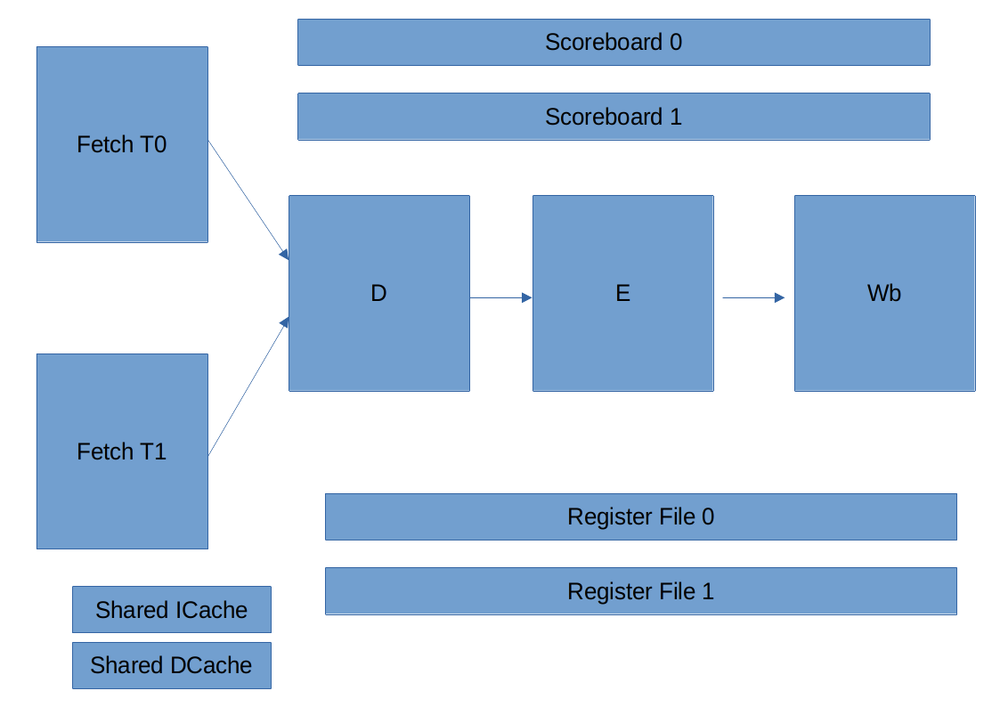

[](https://classroom.github.com/a/_2UmsyHz)
# Lab 4 -- Basic multithreading

Start by copying in `pipelined.bsv`, `Cache32.bsv` and `Cache512.bsv` and `CacheInterface.bsv` from your previous lab, replacing the templates in this repository. You may need to add in any other dependencies you added and modify the `top_pipelined.bsv` as well if you used a cache that does not return on store.
Notice that `top_pipelined.bsv` has been slightly updated in the MMIO section, so if you modify the data memory section, be careful to keep the updated MMIO section (feel free to reach out if you have issues).

## Two-threads machine

In this lab, you are first asked to build a simple processor that hosts two hardware threads.


For this initial version of part a, you can use a simplified implementation where both threads fly through a single queue per stage of the processor, resulting in both threads potentially stalling each-other. 

We are going to have two mutually exclusive Fetch stages that will fetch the appropriate instruction from each thread.

Both threads will start at pc 0 and at some point will diverge. In each of your queues, you will want to keep track of which thread the corresponding instruction is associated with. In this SMT processor, Decode, Execute, and Writeback will handle both.




As a hint we suggest you use the following updated datastructure accross stages:

```verilog
typedef struct { 
                 Bit#(32) pc;
                 Bit#(32) ppc;
                 Bit#(1) epoch; 
                 KonataId k_id; 
                 Bit#(1) thread_id; // NEW
             } F2D deriving (Eq, FShow, Bits);

typedef struct { 
    DecodedInst dinst;
    Bit#(32) pc;
    Bit#(32) ppc;
    Bit#(1) epoch;
    Bit#(32) rv1; 
    Bit#(32) rv2; 
    Bit#(1) thread_id; // <- NEW
    KonataId k_id;
} D2E deriving (Eq, FShow, Bits);

typedef struct { 
    MemBusiness mem_business;
    Bit#(32) data;
    Bit#(32) pc;
    DecodedInst dinst;
    Bit#(1) thread_id; // <- NEW
    KonataId k_id;
} E2W deriving (Eq, FShow, Bits);
```

Your machine will also instantiate 2 register file, two scoreboards and two epochs.

To be able to distinguish the two threads, we do not start the two threads in the same exact state.

We decide to follow the following convention: both threads should start at the
same pc, but one should start with register x10 (a0) initialized to 0, while the other one to
should start with register x10 initialized to 1. This should be reflected when you instantiate your register file for each thread. The test bench handles each path given the x10/a0 value. It will also associate a different stack pointer for each thread.

Considering that a0 is the argument passed to main, it will allow us to write software in C:
```c
int main(int tid) {
  if (tid ==0) {
    // code that should be run by hwthread0
  } else {
    // code that should be run by hwthread1
  }
}
```
The test bench is updated to wait exactly two "exit", i.e., MMIO operation to the special exit location. Hopefully one from each thread, but in case of bug it can get confusing, if one software thread somehow generate multiple MMIO operation to the exit location.
The software testbench is currently such that the mmio operation is sent after returning from main.

Notice that if no argument is used in main, then both thread will run the same code.

Despite its simplicity, your machine is likely to go a bit faster than the baseline pipelined processor.
What are the reasons that make the processor a bit goes faster?  (Show a
Konata screenshot of a situation in your pipelined processor, and why it will
flies better in the 2-threads processor)

If/in cases where it does not go faster, why does it not go faster? (Show a Konata screenshot of a situation in your 2-thread core, where there is an opportunity of speedup if threads could overtake each other)

We will use the same memory caches for both threads since each thread cannot run at the same time. This means that each thread can read the other thread's memory. This is crucial for proper interprocess communication in this lab.

### Understanding the software running

Compare  `test/init.S` with the `test/init.S` of the previous lab, notice the main difference and explain what it does.


### Write a baremetal multicore "consumer-producer" software queue (a software ring buffer). 

Thread0 should iterate over the elements of an array, an push them into a queue.
Thread1 should pull from that queue and sum all the elements.

You should add this to `testMultiCore/src/buffer.c`. 

Please install `gcc-riscv64-unknown-elf` on your machine.

For Debian or WSL:
 ```
 sudo apt-get install gcc-riscv64-unknown-elf
 ``` 
Mac users will need to do:
```
brew tap riscv-software-src/riscv 
brew install riscv-tools
```
Mac users will also need to do: 
```
cd elf2hex
make clean
make
``` 
before compiling any RISC-V programs.

Mac users may also need to download Elf.h.
Create the file at `/usr/local/include/elf.h`. 
e.g. `sudo vim /usr/local/include/elf.h`.
Paste in the Mac version of the definitions file found here: https://gist.github.com/mlafeldt/3885346

Then you can compile your test by doing 
```
cd testMultiCore
make
``` 
Now you run it using `./run_threaded.sh buffer32`.

Please see the `multicore.c` test for inspiration. 

To make your own ring buffer test, you will need to do the following:
* Instantiate your global source array (with some arbitary content) and destination array with zeroes. We want to use static volatile fixed size arrays. We do not have access to the standard library in RISC-V 32 bit. In C this is done as follows:
```c
static volatile int input_data[8] = {0,1,2,3,4,5,6,7};
static volatile int buffer_data[8] = {0,0,0,0,0,0,0,0};
```
* You will also need a global variable called `flag` that will act as your synchronization location, keeping track of inter-thread communication. This should look something like `static volatile int flag = 0;`
* In program thread 0, you will need to copy all data from `input_data` into `buffer_data` in a loop.
* Once we are done, we want to release our semaphore, setting our flag to 1. Once this is done, we can consider this thread to be successful and do `return 0`;
* In program thread 1, we want to wait (loop) until our flag is 1.
* Then, in thread 1, sum the entire content of `input_data`. We want to use a local integer variable `sum`.
* We want to then check if the sum is what you expect (e.g. 28 in the sample) and do `return 0` if true and `return 1` if false (pass or fail).

You can use `putchar(char x)` to print any single character for debugging. We provide the strings "success" and "failure" for reference but you do not need them. You can copy the logic for printing these strings from multicore.c. 

## Konata update

Konata supports displaying instruction from different threads. For that, one simply needs to specify at fetch time which thread we are fetching from.

```verilog
// When fetching from thread 0:
	let iid <- fetch1Konata(lfh, fresh_id, 0);
	
// When fetching from thread 1:
  let iid <- fetch1Konata(lfh, fresh_id, 1);
```

Note that we only need to specify the thread of the instruction at fetch time (when calling fetch1Konata).

## Running tests

Run `make all` first. then....

We have a collection of a few tests:
  add32, and32, or32, hello32, thelie32, mul32, ... (see the full list in test/build/)

To run one of those tests specifically you can do:

```
./run_pipelined.sh add32
```

And for some multithreading tests...(multicore32, matmulmulti32)
```
./run_threaded.sh multicore32
```


Those will generate a trace `pipelined.log` that can be opened in Konata.


You can also run all the tests with:
```
./test_all_pipelined.sh
```
(We removed matmul32 as it would require a little adaptation to run in this 2 threads version)

Notice that now, it reports that two thread ran, with the number of cycle for each of them.
Right now, for all those benchmarks, both thread run the same benchmark in parallel.


# Submitting
`make submit` will do it all for you :)

